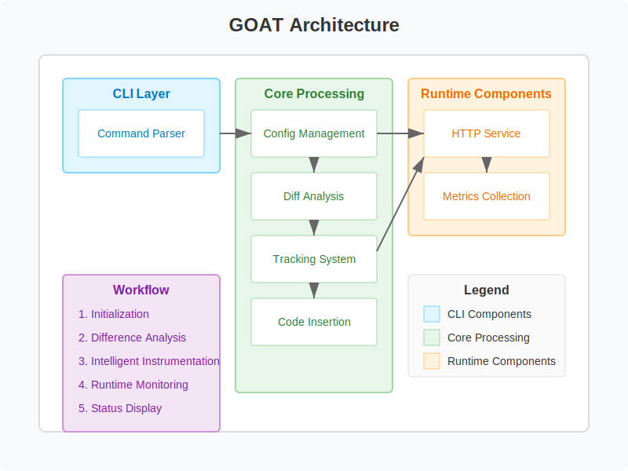

# GOAT - Golang 应用追踪工具

[](https://goreportcard.com/report/github.com/monshunter/goat)
[](https://godoc.org/github.com/monshunter/goat)
[](https://github.com/monshunter/goat/blob/main/LICENSE)

[English](README.md) [Wiki](https://deepwiki.com/monshunter/goat)

## 简介

`GOAT`（Golang Application Tracing）是一个高性能的代码追踪工具，帮助开发者在应用运行时自动追踪增量代码执行情况。

## 架构



## 功能特性

- 自动检测Git分支变化
- 实时提供新增代码执行覆盖率
- 简单易用，轻松卸载

## 快速开始

### 第一步：安装
```bash
go install github.com/monshunter/goat/cmd/goat@latest
```

### 第二步：项目配置

```bash
goat init
```
### 第三步：插入追踪代码

```bash
goat track
```

### 第四步：运行和监控

- （选项1）prometheus 格式

```
GET http://127.0.0.1:57005/metrics
```

- （选项2）json 格式

```
GET http://localhost:57005/track
```

### 最后：清理

```bash
goat clean
```

## 示例和文档

- [示例目录](examples/zh-cn/README.md)

- [技术文档](docs/zh-cn/technical-architecture.md)

## 许可证

[MIT 许可证](LICENSE)。

## 支持

都不容易，如你喜欢请一键三连：Star & Fork & Watch！
<br>
谢谢！
